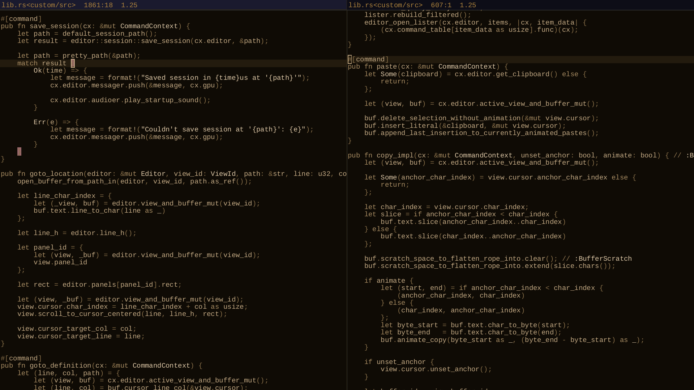

# UNFINISHED

`e2` - Simple, extensible code editor.



# Build

```console
cargo b --profile=release-fast

# If you don't need wayland:
cargo b --profile=release-fast --no-default-features --features=x11

# If you don't need x11:
cargo b --profile=release-fast --no-default-features --features=wayland

# If you don't need neither x11 nor wayland:
cargo b --profile=release-fast --no-default-features
```
